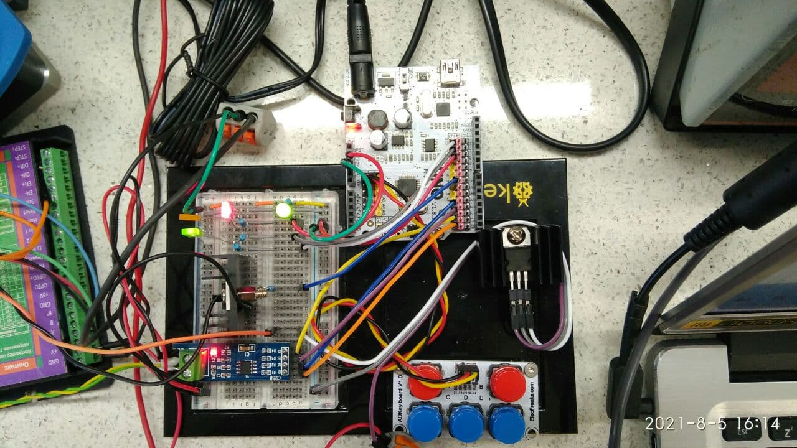
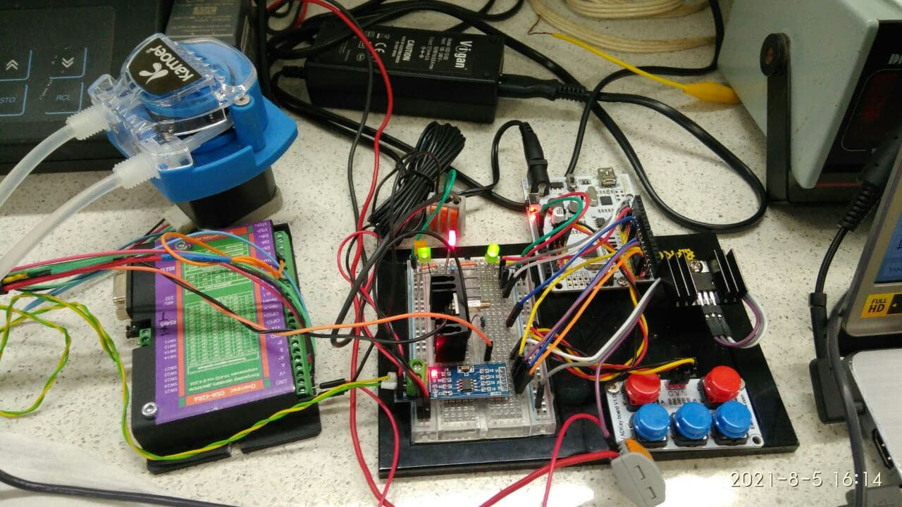

# PETPROJ22

This is a project for the Microcontroller Programming subject (2021). The project is dedicated to build one of IoT item ([project with IoT](https://github.com/AlexanderDKazakov/petproj21)). However, current project is connected with Experimental Setup.

## In action:

## Hardware description:

* Microcontroller: [ATmega 328P](https://www.microchip.com/wwwproducts/en/ATmega328P)
* [Water pump](https://www.kamoer.com/kcm.html) based on step motor (RS485)
* Driver for step motor
* DC motor with gearbox
* Additionals for voltage conversions: IRF520, 7805.
* Power suppliers / wires / etc.

## Acknowledgment

Credits to [Modbus Library](https://github.com/4-20ma/ModbusMaster) developers.
